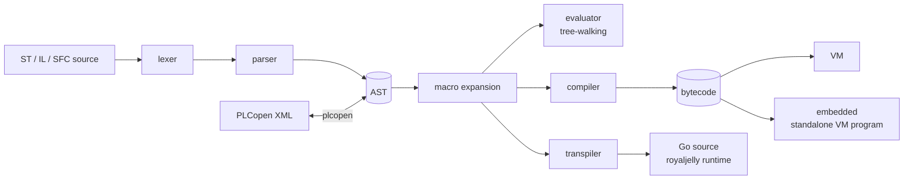

# Architecture

## The pipeline

1. The **lexer** turns source into tokens. It does not reserve IL operators
   or standard block names as keywords; the parser decides from context.
2. The **parser** builds one AST for all three languages, configurations
   and PLCopen imports. It records errors and resynchronizes at the next
   statement, so one mistake does not hide the rest.
3. **Macros** are expanded on the AST before any backend runs.
4. A **backend** runs or compiles the AST: see [Backends](backends.md).

## Packages

| Package | Role |
|---|---|
| `token` | Token types and keywords |
| `lexer` | Source to tokens: nested comments, typed literals (`T#1s`, `16#FF`, `DT#...`) |
| `parser` | Pratt (top-down operator precedence) parser for ST, IL, SFC, POUs, types, configurations; tracing with `-trace` |
| `ast` | The syntax tree, printing back to source, walking and modifying it, namespaces |
| `object` | Runtime values shared by the evaluator and the VM: integers, reals, strings, times, arrays, structures (hashes), function-block instances, built-ins |
| `stdlib` | Stateless built-in functions (conversions, arithmetic, strings, arrays, bit strings, selection, clock) registered with `object` at start-up |
| `evaluator` | Tree-walking interpreter; standard function blocks; tasks and configurations; engineering sessions |
| `code` | Bytecode opcodes and their encoding |
| `compiler` | AST to bytecode: symbol tables, initialization and cyclic bytecode, program variables |
| `vm` | The stack virtual machine that runs bytecode |
| `transpiler` | AST to Go source for royaljelly; OSCAT functions from beebread; host binding |
| `plcopen` | PLCopen TC6 XML import, export and validation |
| `embedded` | Generates a standalone Go program that embeds the VM and bytecode |
| `repl` | The interactive read-eval-print loop |
| `main` (root) | The `beedance` command |

The compiler and VM do not import the evaluator, so a host that only runs
bytecode does not carry the interpreter.

## The object model

The evaluator and the VM share `object` values:

- elementary values are boxed (`*object.Integer`-style types per IEC type
  family, `*object.LReal`, `*object.String`, `*object.Time`, ...);
- a STRUCT or a function-block instance is an `*object.Hash` keyed by member
  name;
- an ARRAY is an `*object.Array` with its lower bound;
- built-in functions are `*object.Builtin`, found by index.

Boxing keeps the two engines simple and identical in behaviour; it is
also why the VM is slower than the transpiled Go (see
[Backends](backends.md#choosing-a-backend)).

## Scans

A PLC program runs as an initialization followed by a scan repeated by a
task. The compiler mirrors this: `CompileProgram` and `CompileProgramUnit`
return **initialization bytecode** (declarations, initial values, function
block definitions) and **cyclic bytecode** (the program body). A host runs
the first once and the second every scan, on the same globals. See
[Embedding](embedding.md).

## Design choices

- **One parser, three backends.** Every backend sees the same AST, so a
  program behaves the same whichever runs it; tests run the same programs
  on the evaluator, the VM and the transpiled Go.
- **Standards first.** Context-aware parsing keeps IEC identifiers free
  (a variable may be called `LD` or `R`).
- **No runtime dependencies.** The core uses only the standard library, so
  it builds for microcontrollers with TinyGo as far as each package allows.
- **The host owns time.** The evaluator and the VM read time through
  built-ins a host can replace, so timers follow the host's task clock.
