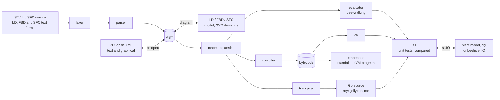

# Architecture

## The pipeline

1. The **lexer** turns source into tokens. It does not reserve IL operators
   or standard block names as keywords; the parser decides from context.
2. The **parser** builds one AST for all three languages, configurations
   and PLCopen imports. It records errors and resynchronizes at the next
   statement, so one mistake does not hide the rest.
3. **Macros** are expanded on the AST before any backend runs.
4. A **backend** runs or compiles the AST: see [Backends](backends.md).
5. **Tests** (`PROGRAM TEST_...`) run on any of the backends through `sil`,
   scan by scan, and the engines are compared: see
   [Testing in the loop](#testing-in-the-loop).

## Packages

| Package | Role |
|---|---|
| `token` | Token types and keywords |
| `lexer` | Source to tokens: nested comments, typed literals (`T#1s`, `16#FF`, `DT#...`) |
| `parser` | Pratt (top-down operator precedence) parser for ST, IL, SFC, POUs, types, configurations; tracing with `-trace` |
| `ast` | The syntax tree, printing back to source, walking and modifying it, namespaces |
| `object` | Runtime values shared by the evaluator and the VM: integers, reals, strings, times, arrays, structures (hashes), function-block instances, built-ins |
| `stdlib` | Stateless built-in functions (conversions, arithmetic, strings, arrays, bit strings, selection, clock) registered with `object` at start-up |
| `evaluator` | Tree-walking interpreter; standard function blocks; tasks and configurations; engineering sessions |
| `code` | Bytecode opcodes and their encoding |
| `compiler` | AST to bytecode: symbol tables, initialization and cyclic bytecode, program variables (with their `VAR_EXTERNAL`s, for a host to bind to its globals) |
| `vm` | The stack virtual machine that runs bytecode |
| `transpiler` | AST to Go source for royaljelly; OSCAT functions from beebread; host binding |
| `plcopen` | PLCopen TC6 XML import, export and validation; LD, FBD and SFC bodies kept graphical both ways |
| `diagram` | The model of the graphical languages: LD and FBD lowered to ST, their text form, PLCopen graphical XML both ways, and SVG drawings of LD, FBD and SFC bodies for previews |
| `native` | Function blocks implemented in Go, given to a program by its host (for example the TCP/IP blocks OSCAT NETWORK needs) |
| `watch` | What a host can watch of a running program, on either engine, under dotted names (`p.tSample.ET`) |
| `sil` | Unit tests (`PROGRAM TEST_...`) on the evaluator, the VM and the transpiled Go, compared scan by scan; I/O from a plant model, a rig over the rig protocol (TCP or serial), or a host such as beehive (`sil.IO`) |
| `embedded` | Generates a standalone Go program that embeds the VM and bytecode |
| `embedded/rig/pico` | A hardware-in-the-loop rig on a Raspberry Pi Pico, built with TinyGo: the rig protocol on its serial port, 8 digital inputs, 8 outputs, 3 analog inputs |
| `embedded/picosim` | Tests of Pico firmware, the rig among it, on an emulated RP2040 in Docker (build tag `picosim`) |
| `connectors/honeycomb` | A module of its own: program variables to and from honeycomb tags, by address |
| `repl` | The interactive read-eval-print loop |
| `main` (root) | The `beedance` command |

The compiler and VM do not import the evaluator, so a host that only runs
bytecode does not carry the interpreter.

## The object model

The evaluator and the VM share `object` values:

- elementary values are boxed (`*object.Integer`-style types per IEC type
  family, `*object.LReal`, `*object.String`, `*object.Time`, ...);
- a STRUCT or a function-block instance is an `*object.Hash` keyed by member
  name;
- an ARRAY is an `*object.Array` with its lower bound;
- built-in functions are `*object.Builtin`, found by index.

Boxing keeps the two engines simple and identical in behaviour; it is
also why the VM is slower than the transpiled Go (see
[Backends](backends.md#choosing-a-backend)).

## Scans

A PLC program runs as an initialization followed by a scan repeated by a
task. The compiler mirrors this: `CompileProgram` and `CompileProgramUnit`
return **initialization bytecode** (declarations, initial values, function
block definitions) and **cyclic bytecode** (the program body). A host runs
the first once and the second every scan, on the same globals. See
[Embedding](embedding.md).

## Design choices

- **One parser, three backends.** Every backend sees the same AST, so a
  program behaves the same whichever runs it; tests run the same programs
  on the evaluator, the VM and the transpiled Go.
- **Standards first.** Context-aware parsing keeps IEC identifiers free
  (a variable may be called `LD` or `R`).
- **No runtime dependencies.** The core uses only the standard library, so
  it builds for microcontrollers with TinyGo as far as each package allows.
- **The host owns time.** The evaluator and the VM read time through
  built-ins a host can replace, so timers follow the host's task clock.

## Testing in the loop

The same `PROGRAM TEST_...` unit tests run three ways (details in
[Hardware in the loop](hil.md) and [Command line](cli.md#unit-tests)):

| | The plant is | The clock is | Engines compared |
|---|---|---|---|
| Software in the loop | absent | simulated | yes, scan by scan |
| With a plant model | a `sil.IO` in Go | simulated, or the wall clock | with `Deterministic` |
| Hardware in the loop | a rig (TCP or serial), or beehive's I/O | the wall clock | no: each engine is judged on its own run |

- The **evaluator** is the simulator and debugger; the **VM** and the
  **transpiled Go** are what run on a target. `sil` runs a test on each
  engine it is given (`-engines eval,vm,go`) and, without real I/O, fails it
  when they disagree on any watched value after any scan.
- **I/O** is `sil.IO` (`Begin`, `Read`, `Write`, `End`): the test's located
  variables are the points. `%I` inputs are read before each scan, `%Q`
  outputs written after it. The **rig protocol** (JSON lines) carries it to
  a rig in any language; `sil.ServeRig` serves one in Go, and
  `embedded/rig/pico` is a ready-made rig on a Pico, which CI also runs on
  the emulated Pico (`embedded/picosim`).
- **beehive** runs the same tests on an edge node's tags
  (`LogicService.Test`), with `sil` and its own `sil.IO`.
